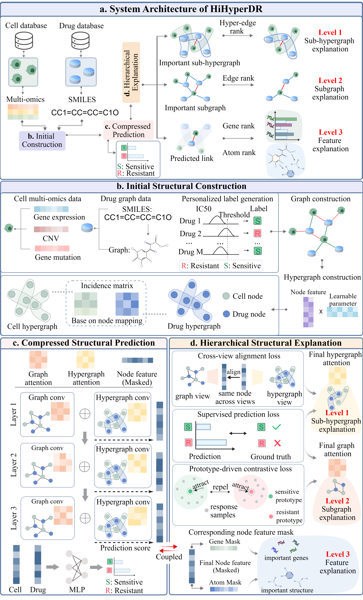

# HiHyperDR

<p align="center">
  
</p>

HiHyperDR is a Hierarchical self-explainable hypergraph learning model for drug response prediction. Unlike post-hoc methods that apply an external explainer after training, HiHyperDR embeds explanation into model optimization. Information Bottleneck constraints jointly optimize prediction and explanation, allowing the model to produce explanations at the feature, local-graph, and global-hypergraph levels that remain aligned with its internal decision logic.

HiHyperDR provides explanations at three complementary levels:

- **Level 1 — Sub-hypergraph explanation:** identifies influential high-order drug–cell associations.
- **Level 2 — Subgraph explanation:** identifies important local interaction structures.
- **Level 3 — Feature explanation:** ranks important genes and drug substructures associated with each prediction.

## Installation

Run all commands from the repository root. Install PyTorch for the CUDA version on your machine, then install the remaining dependencies:

```bash
pip install -r requirements.txt
```

## Data preparation

The datasets used by HiHyperDR are available from [Zenodo](https://doi.org/10.5281/zenodo.21977860). Place the downloaded data under `Code/data/` using the following structure:

```text
Code/data/
├── GDSC/
├── Drugbank/
├── PDTC/
├── TCGA/
└── single cell/
    ├── ALL/
    ├── cancer/
    ├── drug/
    └── tissue/
```

## Reproduce prediction results

Pretrained checkpoints are provided under `Code/Models/ckl/`. Run the following commands from the repository root:

```bash
python -m Code.evaluation.evaluate_prediction --dataset GDSC --checkpoint Code/Models/ckl/GDSC/best_model.pkl --gpu 0
python -m Code.evaluation.evaluate_prediction --dataset DrugBank --config Code/Models/ckl/DrugBank/best_params.json --checkpoint Code/Models/ckl/DrugBank/best_model.pkl --gpu 0
python -m Code.evaluation.evaluate_prediction --dataset PDTC --config Code/Models/ckl/PDTC/best_params.json --checkpoint Code/Models/ckl/PDTC/best_model.pkl --gpu 0
python -m Code.evaluation.evaluate_prediction --dataset TCGA --config Code/Models/ckl/TCGA/best_params.json --checkpoint Code/Models/ckl/TCGA/best_model.pkl --gpu 0
```

The evaluation reports accuracy, precision, recall, AUPR, AUC, F1, and the confusion matrix.

## Model training

GDSC, DrugBank, PDTC, and TCGA use the standard training entry point:

```bash
python -m Code.training.Main --dataset GDSC --gpu 0 --epoch 3000
python -m Code.training.Main --dataset DrugBank --gpu 0 --epoch 3000
python -m Code.training.Main --dataset PDTC --gpu 0 --epoch 3000
python -m Code.training.Main --dataset TCGA --gpu 0 --epoch 3000
```

PDTC and TCGA are stratified into training and test sets at an 8:2 ratio. Checkpoints are saved under `Code/Models/ckl/`.

## Distributed single-cell training

Run the complete single-cell cohort on four GPUs:

```bash
python -m Code.single_cell_distributed.Main --dataset SingleCell --gpus 4 --single_cell_group ALL
```

Run a specific cancer, drug, or tissue subset:

```bash
python -m Code.single_cell_distributed.Main --dataset SingleCell --gpus 4 --single_cell_group cancer --single_cell_subset "Breast cancer" --epoch 3000
```

Valid groups are `ALL`, `cancer`, `drug`, and `tissue`. Subset checkpoints are stored separately under `Code/Models/ckl/SingleCell/`.

## Reproduce explanation results

Evaluate explanation fidelity using the supplied GDSC checkpoint:

```bash
python -m Code.evaluation.explainer_eval_Fidelity --dataset GDSC --checkpoint_dir Code/Models/ckl/GDSC
```

Explanation stability requires a prediction-stable perturbed model. Generate the perturbed model first, and then evaluate stability:

```bash
python -m Code.training.perturbation_model --dataset GDSC --checkpoint_dir Code/Models/ckl/GDSC
python -m Code.evaluation.explainer_eval_Stable --dataset GDSC --checkpoint_dir Code/Models/ckl/GDSC
```

The first command generates `Code/Models/ckl/GDSC/stable_model_1.pkl`, which is required by the stability evaluator.

## Code structure

| Path | Function |
| --- | --- |
| `Code/training/Main.py` | Standard model training entry point |
| `Code/training/DataHandler.py` | Dataset loading and graph construction |
| `Code/training/DatasetConfig.py` | Dataset names, paths, and split configuration |
| `Code/training/FeatureInit.py` | Drug-graph and biological feature initialization |
| `Code/training/Model_sparse.py` | Main HiHyperDR graph–hypergraph model |
| `Code/training/Params.py` | Shared command-line and model parameters |
| `Code/training/perturbation_model.py` | Prediction-stable perturbed-model generation |
| `Code/single_cell_distributed/Main.py` | Distributed single-cell training entry point |
| `Code/single_cell_distributed/DataHandler.py` | Rank-local single-cell data loading and partitioning |
| `Code/single_cell_distributed/Model.py` | DDP-compatible single-cell HiHyperDR model |
| `Code/evaluation/evaluate_prediction.py` | Prediction performance evaluation |
| `Code/evaluation/explainer_eval_Fidelity.py` | Explanation fidelity evaluation |
| `Code/evaluation/explainer_eval_Stable.py` | Explanation stability evaluation |
| `Code/data/` | Dataset files and drug molecular graphs |
| `Code/Models/ckl/` | Trained checkpoints and parameter files |

## Code Ocean

A reproducible environment for HiHyperDR is available on [Code Ocean](https://codeocean.com/capsule/3998050/tree).

## Citation

```bibtex
@software{hihyperdr2026,
  title={Hierarchical Self-Explainable Hypergraph Learning for Drug Response Prediction},
  author={Feng, Zhen and Li, Xiaodi and Qiao, Zhenhua and Yue, Zhenyu},
  year={2026},
  url={https://github.com/Simon8071/HiHyperDR}
}
```

## Contact

If you have any questions or suggestions regarding this work, please feel free to contact us:

- **Zhen Feng:** Simon7@stu.ahau.edu.cn
- **Zhenyu Yue:** zhenyuyue@ahau.edu.cn
